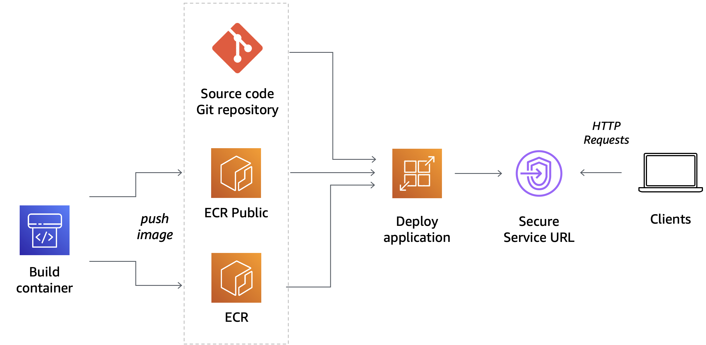

# URL Shortener
URL Shortener is a web application service that lets you generate a shorter link. \
WebApp runs on two public clouds (AWS and Microsoft Azure).

## Getting started with AWS 
WebApp has been deployed to AWS. \
Url service : https://rkbvndnxqe.us-east-1.awsapprunner.com/

In the list bellow, you can see services used:
- Architecture


- Amazon codeCommit
    - deploy source code and compare with GitHub
    - code: ssh://git-codecommit.us-east-1.amazonaws.com/v1/repos/advize-url-shortener
- Amazon ECR
    - fully managed container registry offering high-performance hosting and deploy application images
    - command line example:
    ```
    docker build -t urlshortener .
    docker tag urlshortener:latest xxxxxxxxxxx.dkr.ecr.us-east-1.amazonaws.com/urlshortener:latest
    docker push xxxxxxxxxxx.dkr.ecr.us-east-1.amazonaws.com/urlshortener:latest
    ```
- AWS App Runner
    - build app from ECR
    - deploy the web application automatically, load balances traffic with encryption, scales to meet the traffic needs
    - App service config:
        - Multiple request simultaneously : 80 requests
        - Instances (min): 2
        - Instances (min): 12

## Getting started with Azure 
WebApp has been deployed to Microsoft Azure. \
Url service : https://advize-url-shortener.azurewebsites.net/ \
The service is free (F1: Free)

In the list bellow, you can see services used:
- Architecture


- GitHub
    - deploy source code
    - code: https://github.com/flegallic/url-shortener
- Azure service plan (Linux plan)
    - similar of the container service (ACS)
    - build app from GitHub CI/CD
    - configure an Azure pipeline (ex: https://github.com/flegallic/url-shortener/actions)
    - deploys the web application automatically, load balances traffic with encryption, scales to meet the traffic needs
- Azure app service
    - config:
       - Multiple request simultaneously : 160 requests
       - Instances (min): 1
       - Instances (min): 3

## Javascript
To build this app, I used Nodejs LTS (version 16), express and PUG template.

### To check valid url format
source url: https://www.freecodecamp.org/news/check-if-a-javascript-string-is-a-url/
```
const isValidUrl = urlString => {
  var urlPattern = new RegExp('^(https?:\\/\\/)?'+ // validate protocol
  '((([a-z\\d]([a-z\\d-]*[a-z\\d])*)\\.)+[a-z]{2,}|'+ // validate domain name
  '((\\d{1,3}\\.){3}\\d{1,3}))'+ // validate OR ip (v4) address
  '(\\:\\d+)?(\\/[-a-z\\d%_.~+]*)*'+ // validate port and path
  '(\\?[;&a-z\\d%_.~+=-]*)?'+ // validate query string
  '(\\#[-a-z\\d_]*)?$','i'); // validate fragment locator
return !!urlPattern.test(urlString);
}
```
### To generate a key
source url: https://www.npmjs.com/package/generate-api-key
```
const generateKey = require('generate-api-key');
let urlParams = generateKey({ method: 'base32', max: 6, dashes: false }).substr(0, 6).toString().toLowerCase();
```

### To limit repeated requests to public APIs
source url: https://www.npmjs.com/package/express-rate-limit
```
const rateLimit = require('express-rate-limit');
const createRateLimit = rateLimit({
	windowMs: 60 * 60 * 1000, // 1 hour
	max: 6, // Limit each IP to 100 requests per window
	standardHeaders: true, // Return rate limit info in the RateLimit-* headers
	legacyHeaders: false, // Disable the X-RateLimit-* headers
  message: "message", 
    handler: function(req,res) {
      res.render('index', {err:"Too many request sended from this IP, please try again after an hour"});
    },
});
```

## Create EC2 Instance with Terraform (optional)
Follow the steps to use AWS EC2 service to deploy an instance :
- Clone the repository
- Create ssh keys
```
ssh-keygen -t rsa -f id_rsa_aws
```
- Configure provider.tf file with your AWS credentials
```
provider "aws" {
  region     = "us-east-1"
  access_key = "xxxxxxxxxxxx"
  secret_key = "xxxxxxxxxxxx"
}
```
- Add your ssh public key in the ec2.tf file
```
resource "aws_key_pair" "admin" {
  key_name   = "admin"
  public_key = "ssh-rsa xxxxxxxxxxxxxxxxxxxxxxxxxxxxxxxxxxxxxxxxxxxxxxxxxxxxxxxx"
 }
 resource "aws_instance" "server1" {
  ami           = "ami-052efd3df9dad4825" #ubuntu free
  instance_type = "t2.micro"
  key_name      = "admin"
  tags = {
    Name = "ec2-url-shortener"
  }
 }
```
- Add your public IP in the security_group.tf file
```
resource "aws_default_security_group" "default" {
   vpc_id      = "${aws_default_vpc.default.id}"
 ingress {
     # TLS (change to whatever ports you need)
     from_port   = 22
     to_port     = 22
     protocol    = "tcp"
     # Please restrict your ingress to only necessary IPs and ports.
     # Opening to 0.0.0.0/0 can lead to security vulnerabilities.
     cidr_blocks     = ["x.x.x.x/32"]
   }
 egress {
     from_port       = 0
     to_port         = 0
     protocol        = "-1"
     cidr_blocks     = ["0.0.0.0/0"]
   }
 }
```
- Run command line in the terraform folder
```
terraform init
terraform plan
terraform apply
```
- Connect to your EC2 Instance
	- Get Public IP Address on current EC2 Instance
	- Add your ssh key
	```
	ssh -i .ssh/id_rsa ubuntu@ec2-XX-XX-XX-XX.compute-1.amazonaws.com
	```
